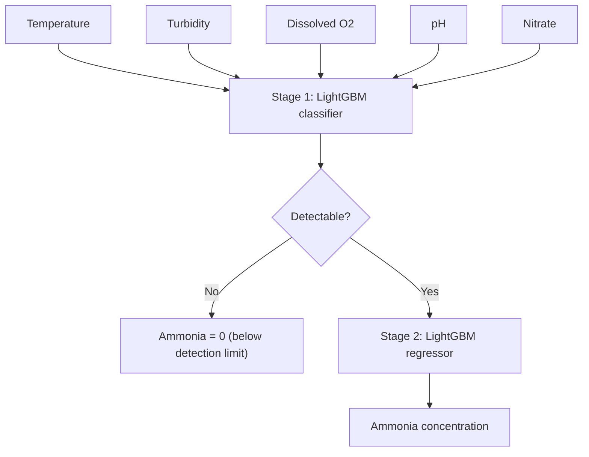

# Ammonia Estimation for Fish Transport — Edge-AI

Estimating dissolved **ammonia concentration** in water from low-cost sensors (temperature, turbidity, dissolved oxygen, pH, nitrate) using a **two-stage LightGBM model** small enough to run on an **ESP32-S3** microcontroller.

> A direct ammonia probe costs roughly ₹1.2–1.3 lakh, far more than the pH, turbidity and temperature sensors it would sit next to. This project asks: *can cheap sensors plus a tiny on-device model estimate ammonia instead?*

---

## Highlights

| | |
|---|---|
| **Stage 1** (is ammonia detectable?) | **98.3 %** accuracy on the test set |
| **End-to-end** (two-stage) | **R² 0.77**, MAE 2.63, RMSE 6.97 |
| **Best single-stage baseline** (Random Forest) | R² 0.60, MAE 4.03, but **12.4 MB** |
| **Two-stage model size** | **~212 KB** as Python pickles, ~161 KB as C++ headers |
| **Inputs** | 5 sensor readings, no scaling needed on the device |

---

## How it works



**Why two stages?** About 31 % of the readings are exactly zero, and they occur in long runs (the longest is 287 consecutive rows). A single regressor has to predict "zero" and "a real concentration" at once, and does both poorly. Splitting the problem works better: Stage 1 decides *whether* ammonia is detectable, and Stage 2 (trained only on detectable rows) decides *how much*.

---

## Results

### Two-stage model (held-out test set, 581 rows)

| Metric | Value |
|---|---|
| Stage 1 accuracy | 0.9828 |
| Stage 1 precision / recall (detectable) | 0.99 / 0.99 |
| Stage 2 alone, on truly detectable rows: R² / MAE / RMSE | 0.811 / 3.74 / 7.25 |
| **End-to-end: R² / MAE / RMSE** | **0.770 / 2.63 / 6.97** |
| Oracle (Stage 2 given the *true* detectable label) | R² 0.847, MAE 2.30, RMSE 5.69 |

The *oracle* row is a diagnostic only. The gap between it and the real pipeline shows how much error comes from Stage 1 mistakes versus Stage 2 itself. Running Stage 2 on *all* rows with no Stage 1 gives R² = −5.18, which shows why the classifier is needed.

<p align="center">
  
  
</p>

### Comparison with single-stage models

Same cleaned data, 80/20 split, `random_state=42`:

| Model | R² | MAE | Size |
|---|---:|---:|---:|
| Linear Regression | 0.18 | 8.85 | 0.5 KB |
| SVR (RBF) | 0.34 | 5.10 | 98 KB |
| Small MLP (16-8) | 0.48 | 5.58 | 30 KB |
| XGBoost | 0.52 | 5.04 | 124 KB |
| Random Forest, edge version (8 trees, depth 4) | 0.51 | 5.15 | 20 KB |
| Gradient Boosting | 0.57 | 4.94 | 133 KB |
| LightGBM (single stage) | 0.57 | 4.54 | 75 KB |
| Random Forest (100 trees) | 0.60 | 4.03 | 12.4 MB |
| **Two-stage LightGBM** | **0.77** | **2.63** | **212 KB** |

With 5-fold cross-validation (scaler fit inside each fold) the single-stage models score: Linear Regression R² 0.19, SVR 0.37, LightGBM 0.65, Random Forest 0.66. `src/cross_validate_two_stage.py` runs the same protocol for the two-stage model. See [Limitations](#limitations) for why this matters.

### What drives the predictions

Both stages rely mainly on **nitrate** and **pH**, then temperature. **Turbidity contributes almost nothing**, which suggests it could be dropped to save a sensor (worth testing).

<p align="center">
  
  
</p>

More plots (beeswarm SHAP, gain and permutation importance) are in [`results/`](results/).

---

## Dataset

**Pond12** sensor log: `TEMPERATURE`, `TURBIDITY`, `DISOLVED OXYGEN`, `pH`, `NITRATE`, and the target `AMMONIA`. After cleaning, 2,902 rows remain.

| Cleaning step | Reason |
|---|---|
| Drop `created_at`, `entry_id` | Row identifiers and timestamps, not usable as features |
| Drop `Population`, `Weight`, `Length` | Constant over the monitoring window |
| Remove `TEMPERATURE == -127` (53 rows) | DS18B20 fault value, not a real reading |
| Remove `AMMONIA` outliers (IQR rule) | Raw data had physically implausible spikes (values up to ~426 billion) |
| Remove `NITRATE > 3000` | A handful of extreme readings |

Place the raw CSV at `data/raw/pond12.csv` before running the pipeline.

---

## Repository structure

```
├── README.md
├── LICENSE
├── requirements.txt
├── data/raw/                  # put pond12.csv here
├── src/
│   ├── config.py              # features, split, model hyperparameters
│   ├── preprocess.py          # cleaning -> data/processed/cleaned_data.csv
│   ├── data.py                # shared stratified train/test split
│   ├── train.py               # trains Stage 1 + Stage 2, saves to models/
│   ├── predict.py             # two-stage inference helper
│   ├── evaluate.py            # metrics + plots -> results/
│   ├── explain.py             # SHAP, gain and permutation importance
│   ├── baselines.py           # 5-fold CV of single-stage models
│   ├── cross_validate_two_stage.py
│   └── export_esp32.py        # LightGBM -> C++ headers
├── firmware/
│   ├── lightgbm_runtime.h     # small tree evaluator for microcontrollers
│   └── lightgbm_esp32_s3.ino  # example sketch
└── results/                   # plots and metrics
```

---

## Quick start

```bash
git clone https://github.com/Ayushkumarsingh24/AMMONIA-ESTIMATION-.git
cd AMMONIA-ESTIMATION-
pip install -r requirements.txt

python src/preprocess.py            # clean the raw data
python src/train.py                 # train both stages
python src/evaluate.py              # metrics + plots
python src/explain.py               # SHAP / importance plots
python src/baselines.py             # (optional) single-stage CV comparison
python src/cross_validate_two_stage.py   # (optional) CV for the two-stage model
```

---

## Deploying to ESP32-S3

1. Export the trained models to C++ headers:
   ```bash
   python src/export_esp32.py
   ```
   This writes `firmware/stage1_model.h` and `firmware/stage2_model.h` (50 trees / 1,198 nodes and 55 trees / 2,785 nodes).
2. Put `stage1_model.h`, `stage2_model.h`, `lightgbm_runtime.h` and `lightgbm_esp32_s3.ino` in one Arduino sketch folder (or a PlatformIO project) and flash to an ESP32-S3. It can also be simulated in [Wokwi](https://wokwi.com/).
3. Open the Serial Monitor at 115200 baud to see the predictions and inference time.

Details:
- Inputs are **raw sensor values**. Tree models are scale-invariant, so no normalisation is needed on the device.
- Feature order must match training: `TEMPERATURE, TURBIDITY, DISOLVED OXYGEN, pH, NITRATE`.
- Stage 1 output is `sigmoid(sum of leaf values)`; the sample is "detectable" when the probability is ≥ 0.5.
- The C++ tree evaluator was checked against a Python reference on random trees and agreed to within float32 rounding (~1e-6).

---

## Limitations

Please read these before relying on the numbers.

- **Random split on time-ordered data.** Consecutive sensor readings are almost identical, so a random 80/20 split can place near-duplicates in both train and test and make scores look better than they would on a new day or a new pond. A time-based or blocked split is the honest test.
- **One pond, one time window.** Generalisation to other ponds, seasons or fish stocks is untested.
- **Truncated target range.** Ammonia outliers were removed, so the model is only valid for the cleaned range (roughly 0–80 in the test set).
- **Zeros may be sensor dropout.** The long zero runs could be genuine "not detected" or the reference sensor dropping out. Stage 1 would then partly learn the dropout pattern.
- **Reference-sensor accuracy is unknown.** The model can only be as good as the labels it was trained on.
- **Comparison caveat.** The two-stage model uses a stratified split, the baselines a plain split, so the test rows differ slightly. Cross-validating both the same way (scripts provided) is the fair comparison.
- Units follow the source dataset.

## Future work

- Time-based validation and testing on a second pond
- Check whether Turbidity can be removed
- Live sensor integration and on-device logging
- Quantisation / smaller trees for lower-memory boards

---

## Author

**Ayush Kumar Singh** — Rajkiya Engineering College, Kannauj. Project work with TIH, IIT Guwahati.

## License

Apache-2.0, see [LICENSE](LICENSE).
